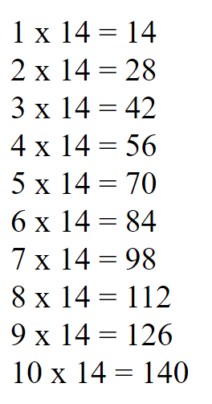

# PHP-ADVANCED - LOOPS

## Taak 03 - For loop tafel van 14

## Opdracht

Maak een script waarmee je de tafel van 14 op het scherm kunt tonen. Maak gebruik van een for-loop.

## Eindresultaat

## Bronnen

> [W3 Schools - PHP Loops FOR](https://www.w3schools.com/php/php_looping_for.asp)
> Zie ook de informatie bij de vorige taak
