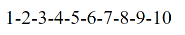

# PHP-ADVANCED - LOOPS

## Taak 01 - For loop 1-2-3

## Opdracht

Maak een script dat het onderstaande resultaat genereert met behulp van een for-loop. De cijfers 1 t/m 10 met streepjes er tussen.

Tip: Maak gebruik van

- for loop
- if en else
- echo

## Eindresultaat

## Bronnen

> [W3 Schools - PHP Loops FOR](https://www.w3schools.com/php/php_looping_for.asp)
> Zie ook de informatie bij de vorige taak
