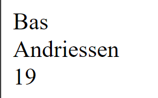

# PHP-ADVANCED - LOOPS

## Taak 05 - Foreach Loop

## Uitleg

Loops is een manier om 1 of meerdere regels PHPcode meerdere keren te laten uitvoeren. We behandelen in PHP Advanced in verschillende taken verschillende soorten loops.

In deze taak wordt de foreach loop behandeld. Kijk naar de video voor een uitleg over de foreach-loop

[Foreach Loop Video](https://web.microsoftstream.com/video/08cb12bd-0829-40b3-b4a8-9cb95808285f)

Aanvullend de PowerPoint gebruikt in de video:
[PowerPoint](https://github.com/ROC-van-Amsterdam-College-Amstelland/PHP-ADVANCED/blob/master/2-Loops/taak03/images/php-loops-foreach.pdf)

Een `foreach` loop gebruik je om de sleutels (keys) en de waardes (values) van een array *automatisch* uit te lezen.

Stel je hebt de $persoon array. Dan kan je daar door heen __loopen__. Elke keer komt er een nieuwe waarde op het scherm.

> Tip. De structuur van een Associatieve array is als volgt: `sleutel => waarde`

```php

$persoon = [ //sleutel    => waarde
            "voornaam"    => "Bas",
            "achternaam"  => "Andriessen",
            "leeftijd"    => 19
        ];

foreach($persoon as $waarde){
    echo $waarde . "<br>"; 

}
```



## Leerdoelen

1. [ ] De student weet wat een loop is algemeen
2. [ ] De student weet wat een foreach loop is en begrijpt hoe deze door een array loopt
3. [ ] De student weet wanneer je kiest voor een foreach loop
4. [ ] De student kan zelf een foreach loop gebruiken in php om de waarden van een array te gebruiken

## Opdracht

1. [ ] Maak een bestand loops-foreach-deel1.php aan
2. [ ] Neem hierin de volgende nummerieke array over:

    ```php
    $dagen = array("maandag", "dinsadg", "woensdag", "donderdag", "vrijdag", "zaterdag", "zondag");
    ```

3. [ ] Maak met behulp van een foreachloop een list (unordered HTML) van de waarden in de array

## Eindresultaat


## Bronnen

> [W3 Schools - PHP loops foreach](https://www.w3schools.com/php/php_looping_foreach.asp)
