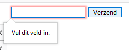

# PHP-ADVANCED - FORMS

## Taak 04 - if-isset

## Uitleg

Soms wil je als ontwikkelaar eerst even check of er echt op een knop gedrukt is of dat een bepaald veld ook werkelijk is ingevuld. Ja, natuurlijk, je kunt een veld verplicht maken op de volgende wijze:

```html
   <!-- zie REQUIRED -->
    <form action="">
        <input type="text" name="personal_access_token" class="form-control" required> 
        <button type="submit" name="submit">Verzend</button>
    </form>
```

Dan geef je de gebruiker een waarschuwing, heej, dit veld is verplicht



Echter is dit niet genoeg beveiliging. Je moet ook op de `server`-kant, de backend van je applicatie ook een _required_ instellen. Dit kun je eenvoudig doen met een `if-statement`.

> "Als dit veld leeg is, doe dan niks. Is er wel iets ingevuld doe dan wel iets"

```php
   if(voorwaarde){

   }
```

En de voorwaarde is checken of een veld 'gevuld' is. Dat doe je met de ingebouwde `isset()` functie

```php
   if( isset($variabele)  ){

   }
```

De `isset()` functie checked of een variabele gedeclareerd is. Bestaat de variabele? Dan __TRUE__. Anders is het antwoord __FALSE__.

```php
   //deze code checked of er key `submit` in de POST array aanwezig is
   if( isset($_POST['submit'] )  ){ 

   }
```

En zoals je weet geeft een`name-attribuut` in een formulier deze `keys` aan. Check even de volgende gegevens.

```html
   <form method="post">
      <input type="text" name="voornaam" class="form-control" placeholder="geef je voornaam aub">
      <input type="text" name="achternaam" class="form-control" placeholder="geef je achternaam aub">
      <input type="number" name="leeftijd" class="form-control" placeholder="geef je leeftijd aub">
      <button type="submit" name="submit" value="verstuurd">Verstuur</button>
   </form>
```

Een POST-array zou er dan zo uit zien:

```php
   $_POST[
      "voornaam"   => "bepaalde ingevulde waarde",
      "achternaam" => "bepaalde ingevulde waarde",
      "leeftijd"   => "bepaalde ingevulde waarde",
      "submit"     => "verstuurd"
   ];
```

Wil je dus met PHP-checken of een gebruiker gebruik heeft gemaakt van de submit-button dan codeer je:

```php
   if(isset($_POST['submit'])){

   }
```

Wil je checken of een invulveld is ingevuld dan doe je:

```php
   if( $_POST['voornaam']  != "" ) ){ // Voornaam is NIET gelijk aan een lege string (dus er is iets ingevuld)

   }
```

of je doet dit:

```php
   if( strlen($_POST['voornaam'])  > 4 ) ){ // Voornaam moet tenminste 4 karakters bevatten(dus de naam JAN is niet toegestaan)

   }
```

## Leerdoelen

- Je kunt op de server-side controleren of een invulveld gevuld is
- Je kunt controleren of een knop is ingedrukt op de server-kant
- Je kunt een opgegeven waarde controleren op lengte.

## Opdracht

1. [ ] Maak een formulier met twee invulvelden een button op een pagina genaamd: `inlog.php`
2. [ ] Het eerste veld is een emailveld en het tweede veld een wachtwoord veld. Geef ze name-attributen
3. [ ] Verstuur het formulier met het action-attribuut naar `process.php`
4. [ ] Check of het emailadres groter is dan 5 karakters en echo dit op het scherm
5. [ ] Check of het wachtwoord minimaal 8 karakters heeft en echo dit op het scherm
6. [ ] Extra: Check of het domein (het gene achter `@` => @domein.com) 'student.rocva.nl` is. Gebruik hiervoor een andere functie. Deze dien je zelf op te zoeken

## Bronnen

> - [W3 Schools - PGP isset()](https://www.w3schools.com/php/func_var_isset.asp)
> - [Stackoverflow - PHP best way to check whether a string is empty or not](https://stackoverflow.com/questions/4531288/php-best-way-to-check-whether-a-string-is-empty-or-not)
